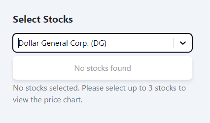

## how to start

```
npm start
```

## how to start storybook

```
npm run storybook
```

## how to run test

```
npm run test
```

or

```
npm run test:ui
```

## Folder structure
```
stock-chart/
├── .storybook/
├── public/
├── screenshots/
├── src/ #
│ ├── components/ # feature specific components, often contains business logic
│ ├── api/ # api client.File name corresponds to api documentation, e.g Tickers=>Tickers.ts,
│ ├── lib/ # shared code used by different features, need to be generic, can't import from features
│ ├── layouts/ # layout components are containers that arrange/group components in some pattern
│ ├── mocks/ # msw handlers and server
│ ├── providers/ # context providers
│ ├── testing/ # testing utilities
│ ├── utils/
│ ├── index.tsx
├── components.json # used by ShadCn
```
PS: if app grows we can add a 'features' folder, right now 'features' are organized within xxxSection folder naming convention to keep it simple and easy to browse through components


## Component features and behaviour

### Select Stocks Combobox

1. Caching
   The initial implementation has an issue, that is, after user have made a selection , close the dropdown, and open it again, the dropdown items disappears because React-Select library considers user input as empty when user opened the dropdown again.
     
   This issue is fixed by manually caching fetched data and set it to defaultOptions such that the next time user opened the dropdown, they will see previous search results as 'default options'  
   
2. Debounce
   The lack of debounce is intentional. This is because with debounce user will not be able to see the 'narrowing' process. That is, instead of seeing the search results of "a", and then "ab" and then "abc", user will experience a lag and see search result of "abc".

### Stock Range Date Picker

1. if user choose a from date greater than end date, end date will be changed to from date.
 
   
2. similarly, if end date is earlier than start date, start date will be set to end date.
3. future dates are disabled  
 

### Stock price chart

- useQueries https://tanstack.com/query/v4/docs/framework/react/reference/useQueries is used to fetch stocks price data in parallel.
- when user add a new stock e.g now we have Apple, and added Google, a new api call will be made to fetch Google data, but no api call will be made to fetch Apple data since Tanstack Query already have cached result for Apple, unless parameters changed (date, price type etc)
- user can click on retry if there is an error
- 

### UI/UX

1. dark mode has been implemented
2. efforts have been made to tweak color theme to have sufficient contrast and with the help of Storybook's a11y add-on
   **Before**
   
   **After**
   
   **A11y colors**
   

## Testing

1. msw is setup to mock http request/response for tests, e.g. stock-chart/src/mocks
2. msw is linked to storybook to provide mocked response
   
3. all components are created with being testable in mind, for example stock-chart/src/providers/ReactQueryProvider.tsx is reusable in tests to allow overriding the app queryClient

## Code Coverage


## Error handling
1. errors are handled as much as possible at component level by rending simple error messages
2. error boundary has been setup to catch application wide errors
   

## Build optimization
1. stats.html is generated at build time to analyze bundle size (rollup-bundle-visulizer-plugin)
2. large libraries are manually split while the rest are put into vendor chunk

## FCP optimization
1. Since Highchart library is relatively large, it is lazily loaded until it is needed. This is done primarily for demo purpose since there is no actual slow loading issue and code splitting is commonly done at route level.
2.   
3.   

## Accessibility
1. keyboard navigations (yes)
2. colors (yes)
3. screen-reader friendly (partial) 


## Misc notes

1. index.html have `<noscript>` tag added
2. types and utils are co-located by default and extracted into separate file only if
   1. a single file is too long and becoming unreadable,
   2. the type/util is shared/duplicated 3 times (following duplicate twice rule)
3. The following react-query options are set considering api rate limit:

```
      refetchOnMount: false,
      refetchOnWindowFocus: false,
      retryOnMount: false,
      staleTime: 5 * 60 * 1000, // 5 minutes
      gcTime: 10 * 60 * 1000, // 10 minutes
      retryDelay: (attemptIndex: number) =>
        Math.min(30 * 1000 * 2 ** attemptIndex, 2 * 60 * 1000), //  try at 30s first, then 60s, then 120s
    })),
```
